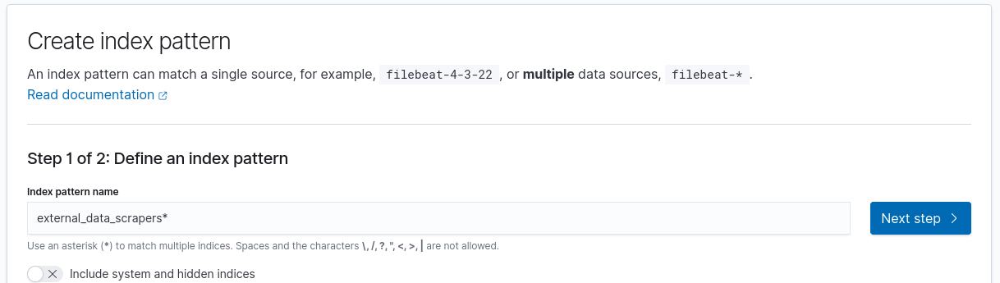
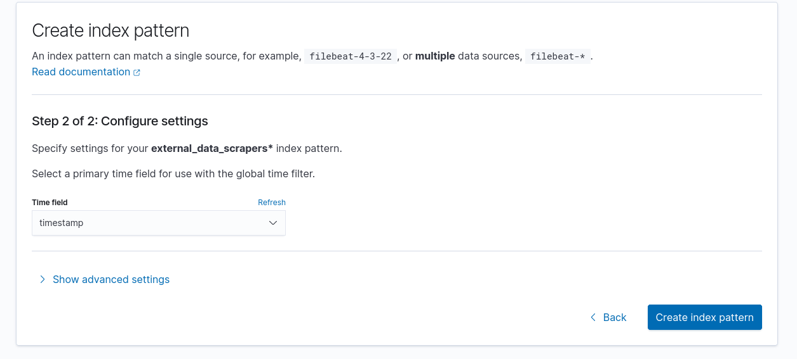

# External data scarpers

Repository for collecting data from publicly available data sources.

## Development

Using well known framework for extracting data from websites [Scrapy](https://scrapy.org/).

## Local development

The provided docker-compose file consist of OpenSearch single node and
OpenSearch Dashboards, which is meant for storing the scraped data. 

### Starting OpenSearch single node

Using OpenSearch cluster with docker-compose.yaml

```
docker-compose up -d
```

On Linux system there is problem starting the opensearch node, so you have to run:
``
sudo sysctl -w vm.max_map_count=262144
``

Ref
https://stackoverflow.com/questions/51445846/elasticsearch-max-virtual-memory-areas-vm-max-map-count-65530-is-too-low-inc

You can now visit http://lcoalhost:5601.

### Scrapers development environment

Setup virtual environment

```
python3 -m venv .venv-spiders
source .venv/bin/activate
pip install -r requirements.txt
```

Start the example scraper.

```
python main.py

```

The main script will query defined url in example scraper every minute.
The scraper also initialize OpenSearch index, so if you want to user OpenSearch
Dashboard to visualize data, you have to create `index pattern` after first
start of main.py the index will be created after approx 1min. 

1. Go to http://localhost:5601/app/management/opensearch-dashboards/indexPatterns/create
2. Type `external_data_scrapers*` (picture 1)
3. Click `NEXT STEP`
4. Select Time field `timestamp (picture 2)
5. Click `CREATE INDEX PATTERN`






## About the Project

Project is part of DataScience@UL-FRI Project Competition 2023, organized by
[Medius d.o.o.](https://medius.si) and [FRI Data Science](https://datascience.fri.uni-lj.si/). 
